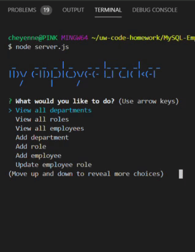
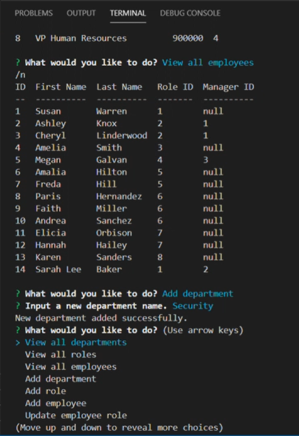

# MySQL-EmployeeTracker

## Demo

Running node.js

## Table of contents

- [General info](#general-info)
- [Technologies](#Technologies)
- [Summary](#Summary)
- [Usage](#Usage)
- [Expectations](#Expectations)
- [Author](#Author)
- [License](#License)

## General info

Command-line application using multiple tools to create a Content Management System (CMS) to keep track of employees work based information. 

## Technologies

- [JavaScript](https://www.javascript.com/)
- [Node.js](https://nodejs.org/)
- [MySQL](https://www.mysql.com/)
- [package.json](https://docs.npmjs.com/creating-a-package-json-file)
- [npm](https://www.npmjs.com/)
## Summary
An employee tracker used as management based to view, add, update any information listed 
you wish to review.
- Departments
- Roles
- Employees

## Usage
- `$ npm install`
- `$ npm install mysql`
- `$ npm install inquirer`
- `$ npm install util`
- `$ npm install ascli`
- `$ npm install colour`
- `$ node server.js`

## Expectations

## Author

Cheyenne Hunt

## License

Open Source